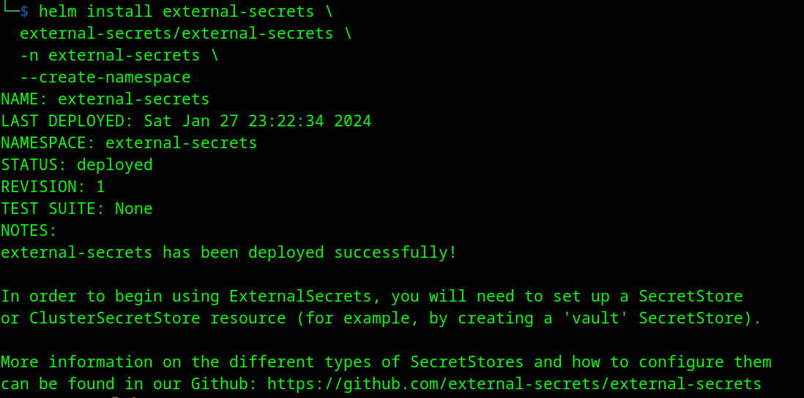
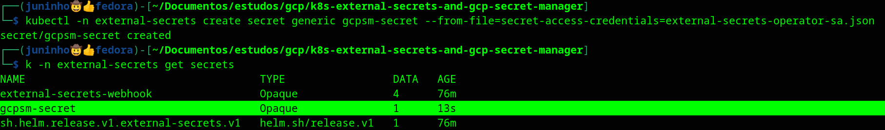
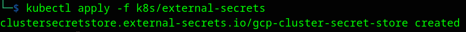
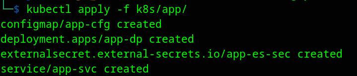
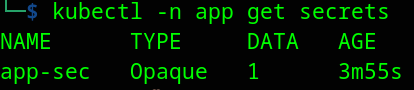
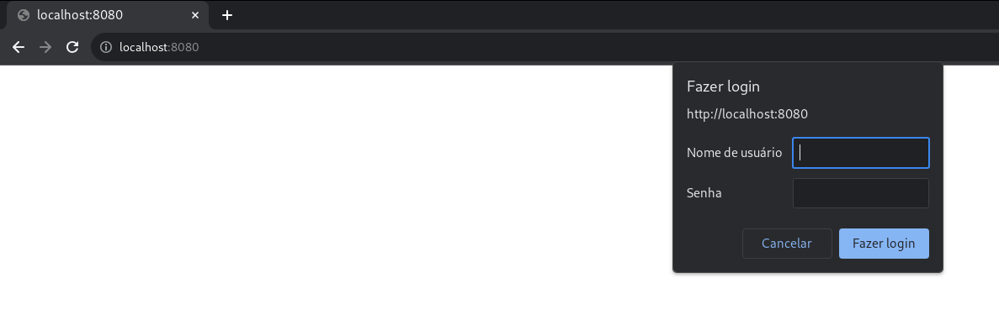
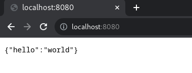

## k8s external secrets and google cloud secret manager

<div align="center">
  
</div>

This project, is an example of how to integrate your Kubernetes cluster with Google cloud secret manager using external secret's operator.
Let's deploy a Node.js application with a middleware configuration that's require a secret called, this secret will be stored in google cloud secret manager, and the external secret's operator will going to get the required secrets from this vault and integrate with Kubernetes cluster.

## Required:
  - Kubernetes cluster.
  - Google cloud account.
  - Gcloud CLI installed.

# What is google cloud secret manager ?

Secret manager is a resource of Google cloud platform, where you can store, manage, and access secrets as binary blobs or text strings. With the appropriate permissions, you can view the contents of the secret.


# Configuring google cloud project

After you being authenticated in glcoud command, let's configure a project that will host the secret manager.<br>obs: if you don't know how to authenticate in gcloud command [click here](https://cloud.google.com/docs/authentication/gcloud), or you can use [cloud shell](https://cloud.google.com/shell/docs/launching-cloud-shell) to run these commands below.

Defining your project:
<pre>
export PROJECT_ID="name of your project"
gcloud config set project $PROJECT_ID
</pre>

Enable secret manager API:
<pre>
gcloud services enable secretmanager.googleapis.com --project $PROJECT_ID
</pre>

## Creating a secret in secret manager

Create a secret:
<pre>
gcloud secrets create PASSWORD
</pre>

Adding a version to secret:
<pre>
echo -n "admin" | gcloud secrets versions add PASSWORD --data-file=-
</pre>
In this case, I'm defining the value of secret as, but you can choose the value that you want.

## Create a Service Account

Creating a Service account that will be use later to authenticate:
<pre>
gcloud iam service-accounts create external-secrets-operator \
  --description="external secrets operator service account" \
  --display-name="external-secrets-operator"
</pre>

Give the role to service account: 
<pre>
gcloud projects add-iam-policy-binding $PROJECT_ID \
  --member=serviceAccount:external-secrets-operator@$PROJECT_ID.iam.gserviceaccount.com \
  --role=roles/secretmanager.secretAccessor
</pre>

<div id='generateKeyServiceAccount'/>  

## Generate a key of service account
We need to create a JSON key from a service account so that the external secret operator can authenticate to Google Cloud Secret Manager. To generate this key, follow these steps below.

Generate a key of service account:
<pre>
gcloud iam service-accounts keys create ./external-secrets-operator-sa.json \
  --iam-account=external-secrets-operator@vault-secrets.iam.gserviceaccount.com
</pre>
Obs: **It's really important you keep this JSON file secure**, after you created let's send this file to secret manager, and delete this sensitive file after use:
<pre>
gcloud secrets create external-secrets-operator-sa --data-file=external-secrets-operator-sa.json
</pre>

</div>

## What is external secrets operator ?

External Secrets Operator is a Kubernetes operator that integrates external secret management systems like AWS Secrets Manager, HashiCorp Vault, Google Secrets Manager, Azure Key Vault, IBM Cloud Secrets Manager, CyberArk Conjur and many more. The operator reads information from external APIs and automatically injects the values into a Kubernetes Secret.

## Install external secret operator
Let's install external secret operator, in this case I'm using [helm](https://helm.sh/) to install operator in Kubernetes cluster, you can see the docs about how to install this [here](https://external-secrets.io/latest/introduction/getting-started/).

Add the helm repo:
<pre>
helm repo add external-secrets https://charts.external-secrets.io
</pre>

Installing using helm:
<pre>
helm install external-secrets \
  external-secrets/external-secrets \
  -n external-secrets \
  --create-namespace
</pre>
output:



## Configuring the external secrets
let's create a secret with JSON key of service account that was created in the last [step](#generateKeyServiceAccount). 

To create a secret, run the command below:
<pre>
kubectl -n external-secrets create secret generic gcpsm-secret --from-file=secret-access-credentials=external-secrets-operator-sa.json
</pre>
output:


Obs: I have an alias config that translate 'k' to 'kubectl'.

You can confirm that secret file was created, running the command:
<pre>
kubectl -n external-secrets get secrets
</pre>

<div id="ClusterSecretStore"/>

## Configure a cluster secret store
, the ```ClusterSecretStore``` is a cluster scoped SecretStore that **can be referenced by all ExternalSecrets from all namespaces**. Use it to offer a central gateway to your secret backend.

In the k8s/external-secrets [folder](k8s/external-secrets/) there is the cluster secret storage [file](/k8s/external-secrets/cluster-secret-store.yaml), to configure this file simply enter your ```PROJECT_ID``` in '{{PROJECT_ID}}' and apply it to the cluster.

Example of file:
<pre>
apiVersion: external-secrets.io/v1beta1
kind: ClusterSecretStore
metadata:
  name: gcp-cluster-secret-store
spec:
  provider:
    gcpsm:
      auth:
        secretRef:
          secretAccessKeySecretRef:
            name: gcpsm-secret
            key: secret-access-credentials
            namespace: external-secrets
      projectID: {{PROJECT_ID}}
</pre>

After you configure this file, let's apply in cluster:
<pre>
kubectl apply -f k8s/external-secrets
</pre>
output:



</div>

## How the app will get secrets ? 🤔
Let's deploy the example application to the cluster, but do you know how the application will obtain the secrets? 🤔 And what changes in the deployment when we use an external secret operator?🤔.

In the normal case, you will create a file with ```kind: secret``` with an ```key=value``` of your secret and apply it to the cluster, but in this case you will need to create a file ```kind: ExternalSecret ``` where you configure the [ClusterSecretStore](#ClusterSecretStore), the **name of the secret file that will be created in the namespace**, and its **keys in the Google cloud secret manager**, and the **name of that key in the secret file**, here is an example of ExternalSecret [file](k8s/app/app-sec.yaml):

<pre>
apiVersion: external-secrets.io/v1beta1
kind: ExternalSecret
metadata:
  name: app-es-sec
  namespace: app
spec:
  refreshInterval: 1h  # rate SecretManager pulls GCPSM
  secretStoreRef:
    kind: ClusterSecretStore
    name: gcp-cluster-secret-store # name of cluster secret store
  target:
    name: app-sec    # name of the k8s Secret to be created
    creationPolicy: Owner
  data:
  - secretKey: PASSWORD # name of secret in secret file
    remoteRef:
      key: PASSWORD  # name of the GCPSM secret key
</pre>

## Let's deploy the app

Create namespace:
<pre>
kubectl create ns app
</pre>

Deploying the app:
<pre>
kubectl apply -f k8s/app/
</pre>
output:



Let's see if the secret file was created in cluster:
<pre>
kubectl -n app get secrets
</pre>
output:



## Testing app:

Let's test the application:
<pre>
kubectl -n app port-forward service/app-svc 8080:8080
</pre>

Accessing the application in browser:



After we log in we can see the message:



## Conclusion

The external secrets operator is an incredible resource for connecting your Kubernetes cluster with various vault options available, and this tool will greatly simplify the process of defining, versioning, securing and sharing secrets between applications and the environment, as this flow becomes more dynamic.